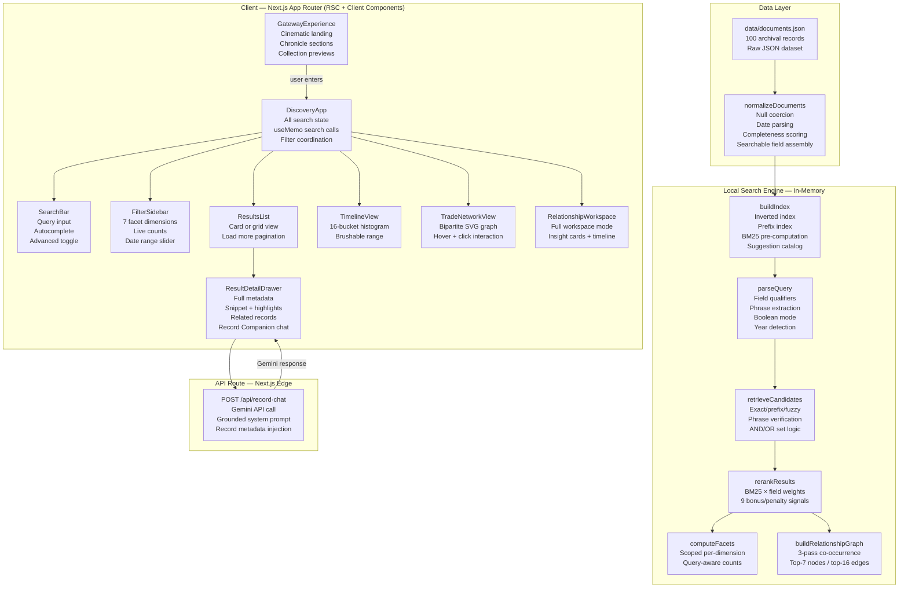
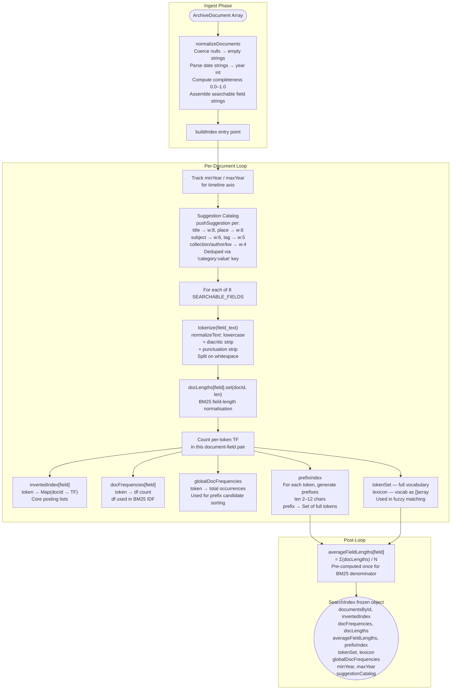
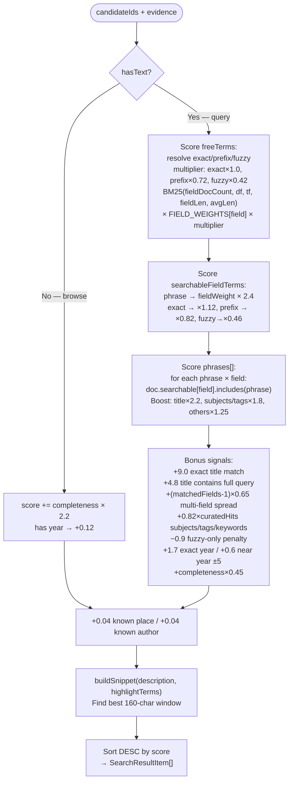
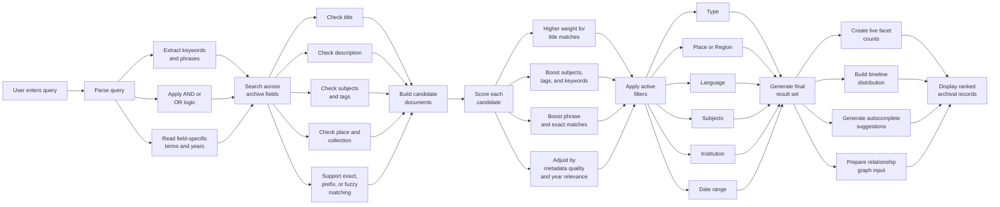
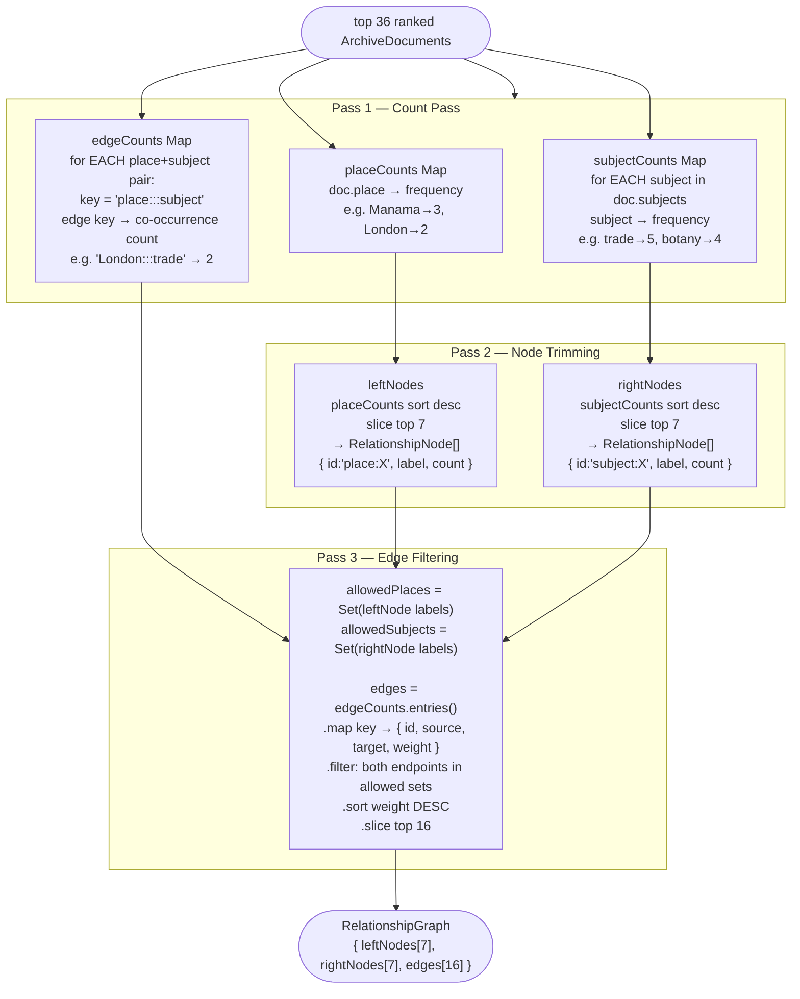
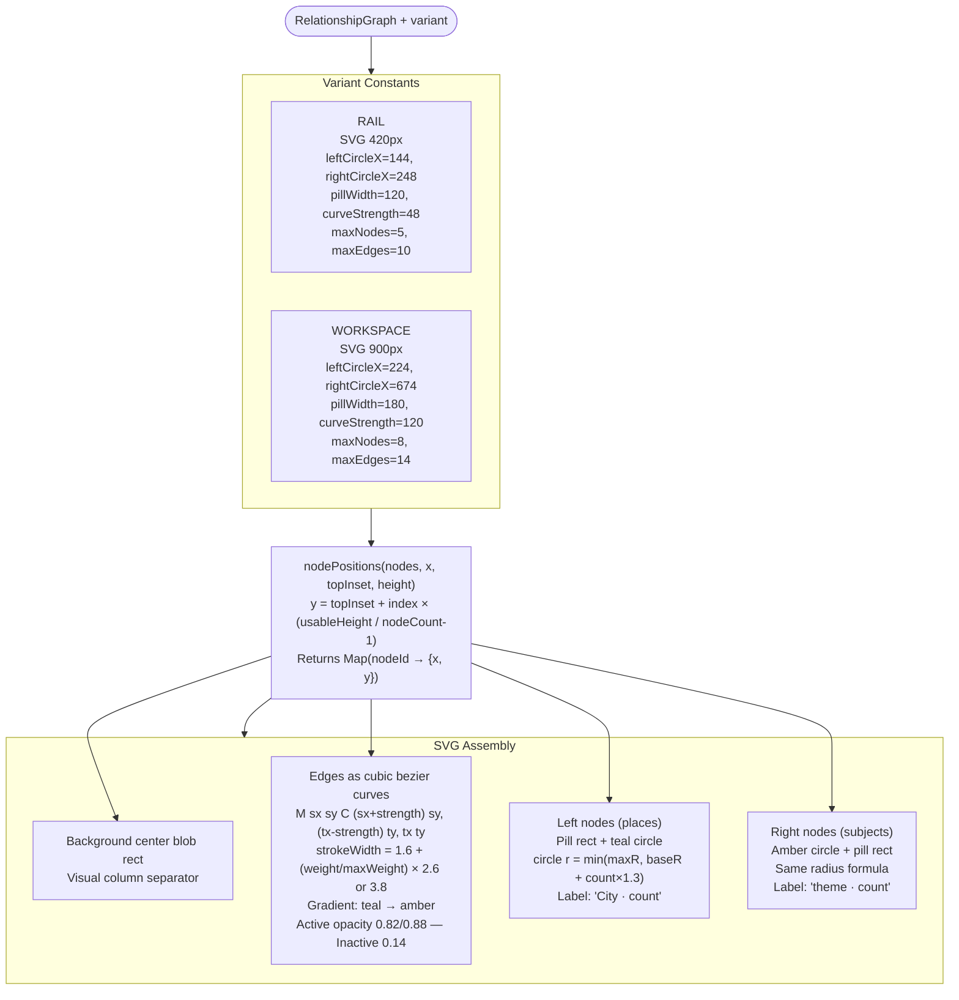
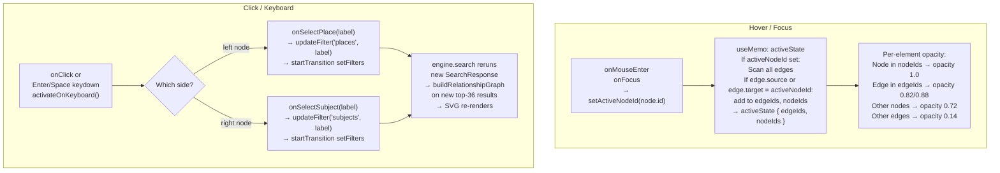
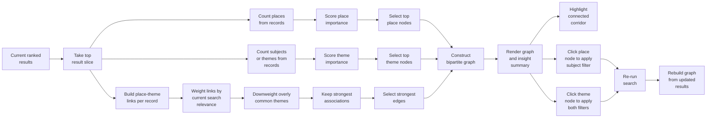
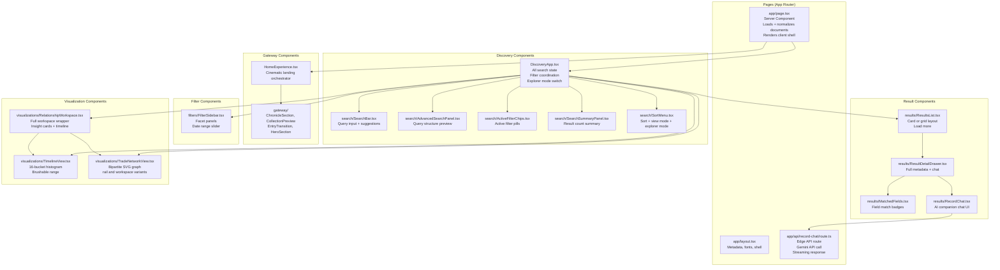
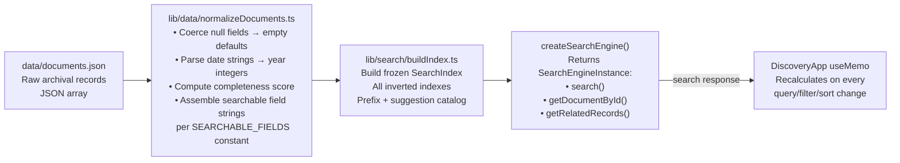

# 🏛️ Archival Atlas — The Digital Curator

> *An archival discovery system that lets users search, connect, and interrogate historical records like a curator — not a database.*

[](https://nextjs.org/)
[](https://react.dev/)
[](https://www.typescriptlang.org/)
[](https://tailwindcss.com/)

---

## 📖 Table of Contents

- [Overview](#-overview)
- [Problem Statement](#-problem-statement)
- [Solution Design](#-solution-design)
- [Key Features](#-key-features)
- [System Architecture](#-system-architecture)
- [Search Engine — Deep Dive](#-search-engine--deep-dive)
- [Relationship Explorer — Deep Dive](#-relationship-explorer--deep-dive)
- [AI Record Companion](#-ai-record-companion)
- [Component Architecture](#-component-architecture)
- [Data Pipeline](#-data-pipeline)
- [Tech Stack](#-tech-stack)
- [Project Structure](#-project-structure)
- [Setup & Running](#-setup--running)
- [Example Queries](#-example-queries)
- [Why This Project Stands Out](#-why-this-project-stands-out)
- [Future Roadmap](#-future-roadmap)

---

## 🌐 Overview

**Archival Atlas** is a premium historical archive exploration experience built around a curated dataset of archival records spanning the Gulf region, Middle East, and Indian Ocean trade networks. It combines:

- a **fully local, custom-built BM25 search engine** with exact, prefix, phrase, and fuzzy matching
- **live faceted filtering** across 7 dimensions
- **timeline distribution** visualization with brushable date range
- a **place-to-theme relationship graph** built dynamically from the current result slice
- a **record-detail drawer** with matched-field highlighting, relevance explanation, and related records
- a **grounded AI companion** scoped to each individual record's metadata

The goal is not simply retrieval. It is to help historians, researchers, and curious explorers understand **why records matter, how they relate, and where to investigate next**.

---

## ❗ Problem Statement

Traditional archive interfaces make discovery harder than it should be:

| Problem | Impact |
|---|---|
| Search is literal and brittle | Typos and spelling variants return nothing |
| Metadata relationships stay hidden | A researcher cannot see what themes cluster around a place |
| Filters feel disconnected from results | Facets do not update as the query changes |
| Records exist in isolation | No sense of "what should I look at next" |
| No chronological sense | A flat list loses the temporal arc of a collection |
| Generic AI assistants | Chatbots hallucinate without grounding in the document |

For historical collections, discovery is not only keyword lookup. It is chronology, place, theme, provenance, and interpretive context.

---

## 💡 Solution Design

Archival Atlas treats archive search as a **guided research workflow** with five stages:

```
Query → Retrieve → Filter → Relate → Interpret
```

1. **Query** — rich syntax parsing that understands phrases, field qualifiers, years, and boolean operators
2. **Retrieve** — a multi-tier lexical engine (exact → prefix → fuzzy) that returns candidates with full match evidence
3. **Filter** — seven facet dimensions computed live from the query-matched set
4. **Relate** — a dynamic bipartite graph of place-to-theme corridors built from the ranked result slice
5. **Interpret** — a per-record AI companion grounded strictly in that record's metadata and context

---

## ✨ Key Features

### 1. 🔍 Field-Aware Search Engine

The engine indexes eight curated archival metadata fields with individual BM25 weights:

| Field | Weight | Rationale |
|---|---|---|
| `title` | 5.0 | Highest editorial signal |
| `subjects` | 4.0 | Controlled vocabulary |
| `tags` | 3.5 | Curated descriptors |
| `keywords` | 3.0 | Additional descriptors |
| `description` | 2.2 | Free text, lower precision |
| `place` | 2.0 | Geo provenance |
| `author` | 1.7 | Person entity |
| `collection` | 1.5 | Institutional context |

### 2. ⚙️ Advanced Query Parsing

The query parser (`parseQuery.ts`) supports:

| Syntax | Example | Behavior |
|---|---|---|
| Free text | `gulf trade` | AND-joined free terms across all fields |
| Quoted phrase | `"persian gulf"` | Substring match, phrase-boosted score |
| Field qualifier | `place:doha` | Targeted lookup in specific field |
| Field + phrase | `author:"Ibn Battuta"` | Field-scoped phrase match |
| Year | `1850` | Exact year score boost +1.7 |
| Year range | `1840-1900` | Applied as date filter AND used in ranking |
| Boolean AND | `maritime AND trade` | Intersects candidate sets |
| Boolean OR | `arabic OR persian` | Unions candidate sets |

### 3. 🎯 Three-Tier Lexical Matching

For every query term, the engine attempts three cascading resolution strategies:

- **Exact** — token is in vocabulary → full score multiplier
- **Prefix** — token matches the start of vocabulary tokens, sorted by global frequency → 0.72× multiplier
- **Fuzzy** — Levenshtein distance ≤ 1 (short terms) or ≤ 2 (8+ characters), same first character filter → 0.42× multiplier, −0.9 penalty if fuzzy is the only match kind

### 4. 🗂️ Live Faceted Filtering

Seven filter dimensions, all query-aware:

- **Type** — manuscript, map, photograph, letter, report…
- **Place** — specific city or location string
- **Region** — broad geographic region
- **Language** — Arabic, English, Persian, Urdu, Ottoman Turkish…
- **Subjects** — controlled vocabulary subjects
- **Institution** — holding archive or library
- **Date range** — brushable year slider from timeline

Facet counts for each dimension exclude that dimension's own filter, so the sidebar always shows available options (not zero-count dead ends).

### 5. 📅 Timeline Explorer

A 16-bucket histogram showing how the **current query-matched, pre-date-filter result set** is distributed over time. Users can click or drag to apply a year range filter directly from the chart. The timeline updates instantly as the query changes.

### 6. 🕸️ Relationship Explorer

A dynamically built bipartite SVG graph (place nodes on the left, theme/subject nodes on the right) computed from the **top 36 ranked results** for the current query+filter state.

- Nodes are sized proportionally to their frequency count
- Edges are weighted by place-subject co-occurrence
- Hovering a node dims all non-connected edges and nodes
- Clicking any node applies it as a filter and re-runs the full search

### 7. 🗃️ Record Detail Drawer

Every result card opens a structured research drawer showing:

- Full normalized metadata
- Field-highlighted snippet showing exactly where terms matched
- "Why matched" reasoning list (up to 4 signals)
- Related records (co-subject + co-place scoring)
- Matched field badges

### 8. 🤖 AI Record Companion

A per-record AI conversation mode inside the drawer, backed by Google Gemini. The model receives a carefully structured prompt containing all metadata fields and match context for that specific record. It cannot make up facts about the record; it must answer strictly from provided metadata.

Chat history is stored per record ID in browser `sessionStorage`, so conversations persist within the session.

### 9. 🎬 Cinematic Gateway Experience

The landing page includes a fully animated gateway: a chronicle expansion sequence, collection previews, and a smooth masked transition into the archive workspace. All transitions are built with Motion (formerly Framer Motion).

---

## 🏗️ System Architecture

### High-Level Component Flow



---

## 🔍 Search Engine — Deep Dive

### Index Construction (`buildIndex.ts`)

Runs **once at startup**. The frozen `SearchIndex` is reused across every query.



### Query Parsing (`parseQuery.ts`)

```mermaid
flowchart LR
    RAW(["Raw string from user"]) --> FQ["① Field qualifier regex\n/field:value/g\nRoutes to:\nsearchableFieldTerms or\nfacetFieldTerms dict"]
    FQ --> PH["② Phrase extraction\n/\"quoted text\"/g\nnormalize → phrases[]"]
    PH --> YR["③ Year range regex\n'1840-1900' or '1840 to 1900'\n→ yearRange tuple"]
    YR --> YS["④ Year scan\n/\\d{4}/g → years[]"]
    YS --> BM["⑤ Boolean mode\n/\\bOR\\b/ → mode=OR\ndefault: AND"]
    BM --> FT["⑥ Free terms tokenize\nremoveStopWords=true\nminLength=2\n→ freeTerms[]"]
    FT --> HL["⑦ Highlight terms union\nphrases ∪ freeTerms ∪\nsearchableFieldTerms values"]
    HL --> OUT(["ParsedQuery object\nready for retrieval"])
```

### Candidate Retrieval (`retrieveCandidates.ts`)

```mermaid
flowchart TD
    PQ(["ParsedQuery"]) --> TG["Assemble termGroups[]\nfreeTerms → all 8 fields\nfieldTerms → targeted field\nphrases → all fields, kind=phrase"]
    TG --> EMPTY{No terms?}
    EMPTY -->|Yes| ALL["Return all doc IDs\nbrowse mode"]
    EMPTY -->|No| ITER["Iterate each termGroup"]
    ITER --> KIND{kind?}
    KIND -->|term| E1["① EXACT\ntokenSet.has(term)"]
    E1 -->|not found| E2["② PREFIX\nprefixIndex.get(term)\nsort by globalDocFreq DESC\nslice top 8"]
    E2 -->|not found, len≥4| E3["③ FUZZY\nFilter lexicon: same first char\n|len diff| ≤ maxDist\nLevenshtein(term, candidate)\nmaxDist: 1 if len<8, else 2\nSort dist ASC, freq DESC\nSlice top 6"]
    E1 & E2 & E3 --> POST["Look up invertedIndex[field].get(token)\n→ postings Map(docId → TF)\nAdd to groupMatches Set\nregisterEvidence() stores:\nmatchedFields, matchKinds,\nmatchedTermsByField, matchedGroups"]
    KIND -->|phrase| PHM["Seed: all docs with any phrase token\nVerify: doc.searchable[field].includes(fullPhrase)\nsubstring check only → kind=phrase"]
    POST & PHM --> GS["Push groupMatches → groupSets[]"]
    GS --> BOOL{mode?}
    BOOL -->|AND| INT["intersectSets(groupSets)\ndocId must appear in all groups"]
    BOOL -->|OR| UNION["flat union — any match qualifies"]
```mermaid
flowchart TD
    CAND(["candidateIds[]\nevidence Map"]) --> RET
    RET(["CandidateRetrieval {\n  candidateIds: string[]\n  evidence: Map(docId → MatchEvidence)\n}"])
```

### Reranking & Scoring (`rerankResults.ts`)



### Full Search Engine Pipeline



### Scoring Formula Reference

| Signal | Value |
|---|---|
| BM25 IDF | `log(1 + (N − df + 0.5) / (df + 0.5))` |
| BM25 TF-norm | `tf × (k₁+1) / (tf + k₁ × (1 − b + b × fieldLen/avgLen))` where k₁=1.2, b=0.75 |
| Exact match multiplier | ×1.0 (free term), ×1.12 (field-targeted) |
| Prefix match multiplier | ×0.72 (free), ×0.82 (field-targeted) |
| Fuzzy match multiplier | ×0.42 (free), ×0.46 (field-targeted) |
| Exact title match | +9.0 |
| Title contains query | +4.8 |
| Multi-field spread | +(matchedFields − 1) × 0.65 |
| Curated metadata hit | +0.82 per subjects/tags/keywords hit |
| Fuzzy-only penalty | −0.9 |
| Exact year | +1.7 |
| Near year (±5) | +0.6 |
| Completeness (query) | × 0.45 |
| Completeness (browse) | × 2.2 |

---

## 🕸️ Relationship Explorer — Deep Dive

The relationship explorer is built from the **current ranked results**, not from the full corpus in isolation. This makes it deeply responsive to what the user is actually investigating.

### Graph Building Algorithm (`buildRelationshipGraph`)

Three-pass co-occurrence scan over the top 36 ranked results:



### SVG Rendering & Layout



### Interaction Model



### Full Relationship Explorer Flow



### Graph Formula Reference

| Property | Formula |
|---|---|
| Node Y position | `topInset + index × (usableHeight / (nodeCount − 1))` |
| Circle radius | `min(maxR, baseR + count × 1.3)` · Rail: baseR=7, maxR=17 · Workspace: baseR=9, maxR=22 |
| Edge stroke width | `1.6 + (weight / maxWeight) × 2.6` (rail) or `× 3.8` (workspace) |
| Bezier control points | `M sx sy C (sx+strength) sy, (tx−strength) ty, tx ty` |
| Active edge opacity | 0.82 (rail), 0.88 (workspace); inactive → 0.14 |
| Label truncation | `label.slice(0, maxLen−1) + "…"` if label.length > 12 (rail) or 18 (workspace) |
| Strongest connection | `graph.edges[0]` — pre-sorted by weight DESC |

---

## 🤖 AI Record Companion

Each record includes a dedicated AI conversation mode inside the drawer, backed by **Google Gemini**.

This is not a general chatbot. It is a **record-scoped research companion**.

**What the AI is grounded in:**

| Category | Fields |
|---|---|
| Identity | `title`, `author`, `date`, `place`, `region` |
| Classification | `type`, `format`, `language` |
| Content | `description`, `subjects`, `tags`, `keywords` |
| Provenance | `institution`, `collection` |
| Search context | `whyMatched[]`, matched fields, match kinds |
| Discovery context | Related records with match reasons |

**What users can ask:**
- "Summarize this record"
- "Why is this document historically significant?"
- "Why did this match my search?"
- "What should I look at next?"
- "Who wrote this and when?"

The system prompt explicitly instructs the model to only answer from the supplied metadata, not from general training knowledge about the topic. This prevents hallucination while still enabling interpretive discussion.

```
Chat history storage: sessionStorage keyed by record ID
Model: Google Gemini (configured via GEMINI_API_KEY)
Fallback: local grounded replies if API is unavailable
```

---

## 🧩 Component Architecture



---

## 📦 Data Pipeline



---

## 🛠️ Tech Stack

| Layer | Technology | Purpose |
|---|---|---|
| Framework | **Next.js 16** (App Router) | Server components, routing, API routes |
| UI runtime | **React 19** | Client component interactivity |
| Language | **TypeScript** | Full type safety across all layers |
| Styling | **Tailwind CSS 4** | Utility-first design system |
| Animation | **Motion** (Framer Motion v12) | Gateway transitions, scroll-driven sections |
| AI | **Google Gemini API** | Grounded record companion chat |
| Search | **Custom in-memory engine** | BM25 + lexical archival discovery |
| Rendering | **Hand-crafted SVG** | Relationship graph — no external graph library |

---

## 📁 Project Structure

```
app/
  api/
    record-chat/
      route.ts              Gemini-backed record companion API route
  globals.css               Global Tailwind styles + CSS variables
  layout.tsx                App metadata, shell, font config
  page.tsx                  Server entry: loads documents, renders client

components/
  DiscoveryApp.tsx          Main workspace: all search state and layout
  HomeExperience.tsx        Gateway orchestrator
  common/
    Badge.tsx               Tone-aware badge component
  filters/
    FilterSidebar.tsx       7-dimension faceted filter panel
  gateway/
    ChronicleSection.tsx    Archive chronicle expansion UI
    CollectionPreview.tsx   Curated collection tiles
    EntryTransition.tsx     Masked cinematic transition
    HeroSection.tsx         Landing hero block
  results/
    MatchedFields.tsx       Field match badge row
    RecordChat.tsx          AI companion chat interface
    ResultCard.tsx          List and grid result card
    ResultDetailDrawer.tsx  Full record detail panel
    ResultsList.tsx         Paginated result list
  search/
    ActiveFilterChips.tsx   Active filter pill row
    AdvancedSearchPanel.tsx Query structure preview panel
    SearchBar.tsx           Query input with autocomplete
    SearchSummaryPanel.tsx  Result count and query summary
    SortMenu.tsx            Sort + view + explorer mode controls
  visualizations/
    RelationshipWorkspace.tsx  Full workspace layout with insight cards
    TimelineView.tsx           16-bucket histogram with range brush
    TradeNetworkView.tsx       Bipartite SVG network (rail + workspace)

data/
  documents.json            100 normalized archival records

lib/
  ai/
    prompt.ts               Gemini system prompt builder
    storage.ts              sessionStorage chat history helpers
  data/
    loadDocuments.ts        Server-side JSON loader
    normalizeDocuments.ts   Raw → ArchiveDocument normalization
  search/
    buildIndex.ts           Inverted index + prefix + suggestions
    computeFacets.ts        Scoped live facet counting
    highlight.ts            Snippet extraction + match marking
    normalizeText.ts        Lowercase + diacritic strip utility
    parseQuery.ts           Full query parser
    relatedRecords.ts       Co-subject + co-place similarity
    rerankResults.ts        BM25 scoring + bonus/penalty signals
    retrieveCandidates.ts   Exact/prefix/fuzzy/phrase retrieval
    searchEngine.ts         Engine factory + graph + timeline builder
    tokenize.ts             Tokenizer + prefix generator + stop words
    types.ts                All shared TypeScript interfaces + constants
  utils/
    format.ts               Date, count, label formatters

assets/
  gateway/                  Hero images and chronicle visuals
```

---

## 🚀 Setup & Running

### Prerequisites

- Node.js 20+
- npm 10+
- A Google Gemini API key (optional — app runs without it)

### 1. Install dependencies

```bash
npm install
```

### 2. Configure environment variables

Create `.env.local` in the project root:

```bash
GEMINI_API_KEY=your_gemini_api_key_here
```

> If the key is missing or the API is unavailable, the Record Companion falls back to local grounded replies. All search, filtering, and graph features work entirely offline.

### 3. Start the development server

```bash
npm run dev
```

Open [http://localhost:3000](http://localhost:3000).

### 4. Production build

```bash
npm run build
npm run start
```

---

## 🔎 Example Queries

| Query | What it does |
|---|---|
| `maritime AND trade` | Requires both terms across all fields |
| `arabic OR persian` | Returns records matching either language term |
| `"persian gulf" map` | Phrase match for "persian gulf" + free term "map" |
| `place:doha AND treaty` | Targets "doha" in place field, "treaty" anywhere |
| `author:"Ibn Battuta"` | Exact phrase match in author field |
| `1840-1900` | Applies year range filter + boosts records with years in range |
| `subject:trade region:gulf` | Field-targeted search on subject and region |
| `manuscript botany` | Free terms across all fields, AND logic |

---

## ⚡ Why This Project Stands Out

- **Archives as relationship systems** — the relationship explorer treats metadata not as labels but as a navigable graph of meaning
- **Fully local, zero-latency search** — the custom BM25 engine with prefix and fuzzy tiers runs entirely in-browser memory with no server round-trips
- **Evidence-first results** — every result shows exactly which fields matched, which terms triggered, and why it scored high
- **Grounded AI, not hallucinating AI** — the Gemini companion is strictly scoped to provided record metadata; it cannot invent facts
- **The graph is the search** — clicking a node in the relationship explorer does not just highlight; it re-runs the full search and rebuilds the graph from the new results
- **Premium design without compromise** — from the cinematic gateway transition to the SVG physics of the relationship graph, everything is designed to feel like a research instrument

---

## 🗺️ Future Roadmap

- [ ] **Alternate graph lenses** — place-to-collection, subject-to-type, author-to-place networks
- [ ] **Semantic search layer** — embed records with vector representations and add hybrid BM25 + cosine retrieval
- [ ] **Larger datasets** — background web worker indexing for 10k+ record corpora
- [ ] **Citation-aware AI** — companion answers that cite related records inline
- [ ] **Image and scan support** — ingest digitized scans with OCR-backed text search
- [ ] **User collections** — save searches, curate record trails, annotate discoveries
- [ ] **Export** — export a result set or relationship graph as CSV, JSON, or a shareable link
- [ ] **Multi-language query support** — Arabic and Persian query normalization

---

## 📄 License

This project was built as a hackathon submission for **Archival Atlas**. Add a license here if you plan to distribute or open-source it formally.

---

<div align="center">
  <sub>Built with care for historical discovery. Every record has a story worth finding.</sub>
</div>
