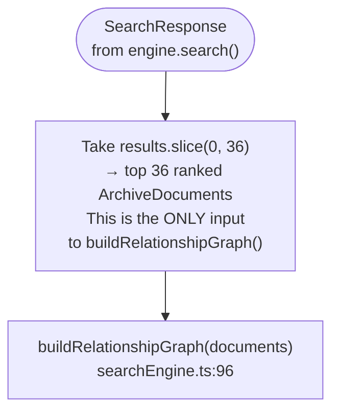
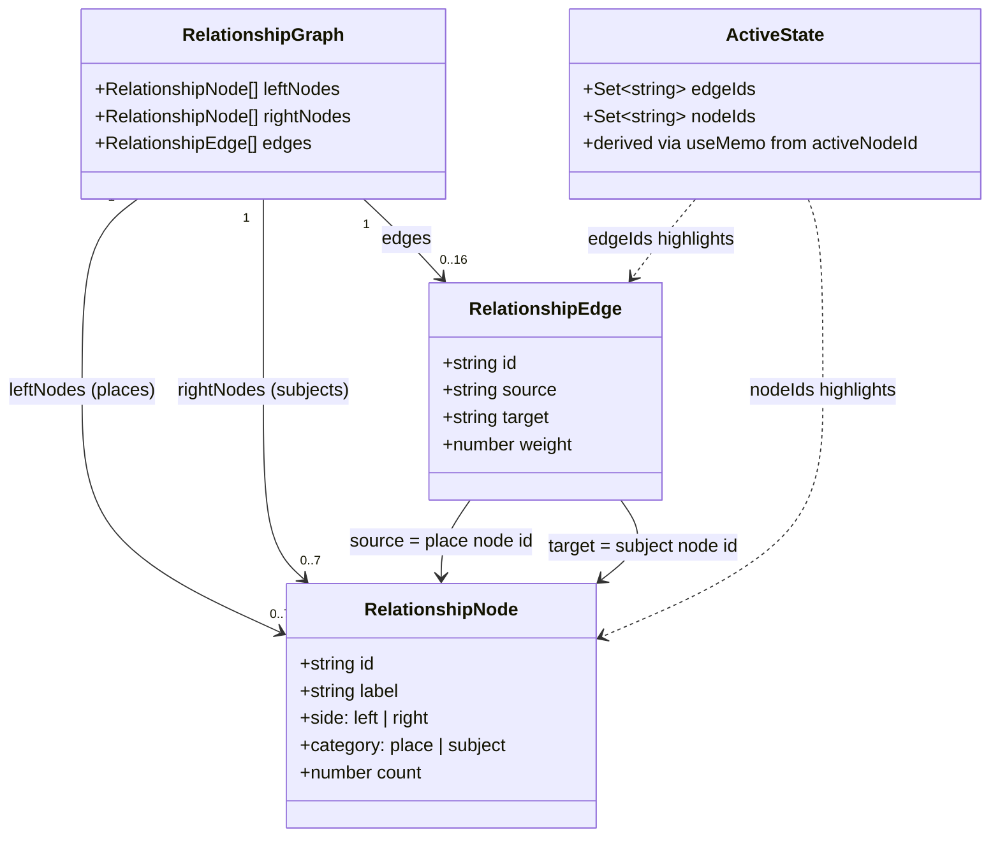
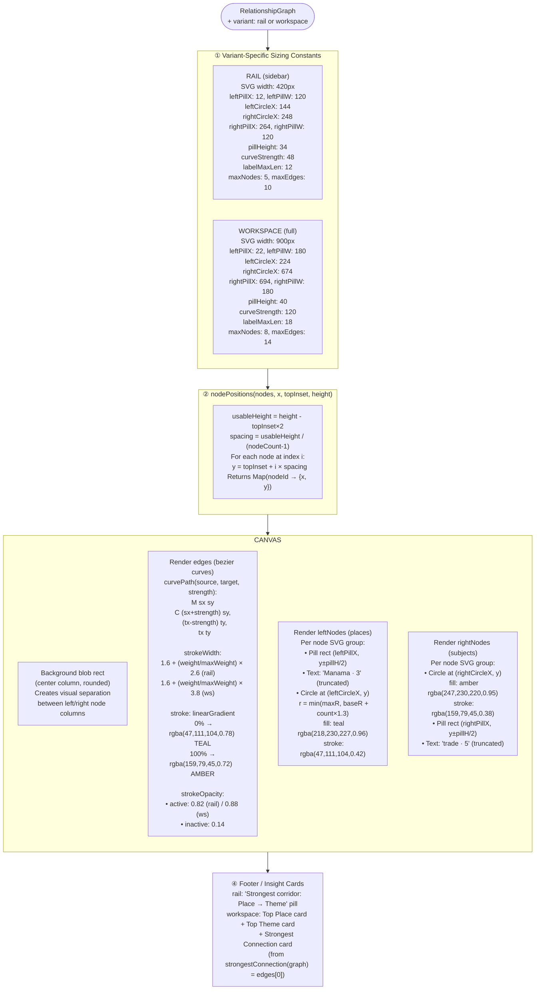
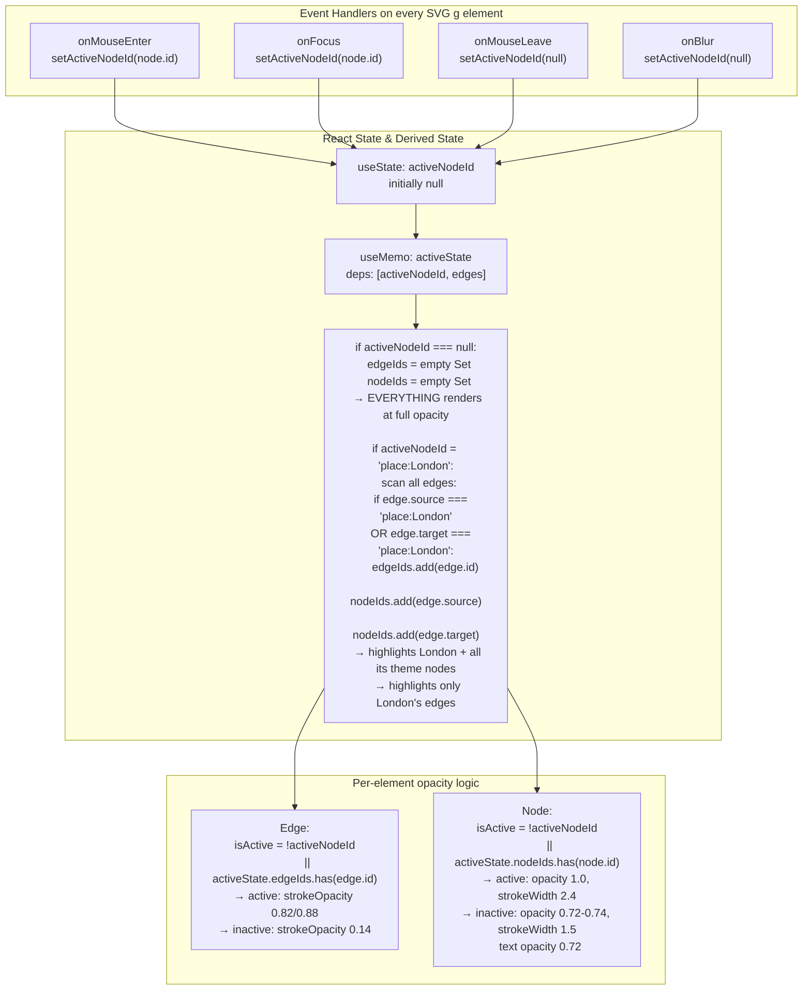
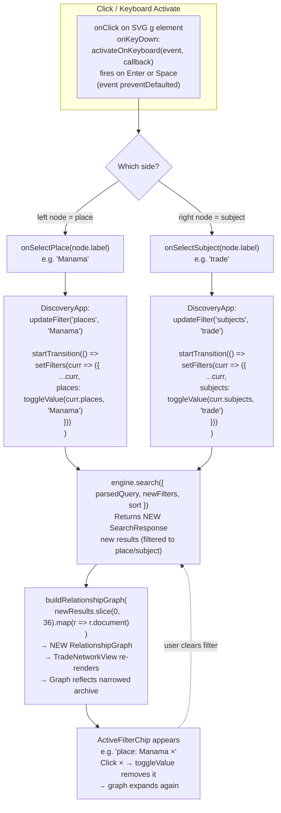

# Relationship Explorer — Complete Technical Flow

> End-to-end: from ranked results → graph data → SVG rendering → hover interactions → search pivot.

---

## 🔁 Phase 0 — Trigger & Data Source



---

## 🧮 Phase 1 — Graph Builder (`buildRelationshipGraph`)

```mermaid
flowchart TD
    DOCS([ArchiveDocument[]\nmax 36]) --> PASS1

    subgraph PASS1["① Count Pass — iterate every document"]
        PC["placeCounts Map\ndoc.place → frequency\nAccumulates per unique place string\ne.g. Manama → 3, London → 2"]
        SC["subjectCounts Map\nFor EACH subject in doc.subjects[]\nsubject → frequency\ne.g. 'trade' → 5, 'botany' → 4"]
        EC["edgeCounts Map\nFor EACH (place, subject) pair:\nedgeKey = 'place:::subject'\nMap key → co-occurrence count\ne.g. 'London:::trade' → 2\nThis is the CORE relationship weight"]
    end

    DOCS --> PC & SC & EC

    subgraph PASS2["② Node Creation Pass"]
        LN["leftNodes = placeCounts.entries()\n.sort((a,b) => b[1]-a[1])   ← freq desc\n.slice(0, 7)                  ← top 7 only\n.map → RelationshipNode {\n  id: 'place:Manama'\n  label: 'Manama'\n  side: 'left'\n  category: 'place'\n  count: 3\n}"]

        RN["rightNodes = subjectCounts.entries()\n.sort((a,b) => b[1]-a[1])   ← freq desc\n.slice(0, 7)                  ← top 7 only\n.map → RelationshipNode {\n  id: 'subject:trade'\n  label: 'trade'\n  side: 'right'\n  category: 'subject'\n  count: 5\n}"]
    end

    PC --> LN
    SC --> RN

    subgraph PASS3["③ Edge Creation Pass"]
        AL["allowedPlaces = Set( leftNode.labels )\nallowedSubjects = Set( rightNode.labels )"]

        EE["edges = edgeCounts.entries()\n.map key 'place:::subject'\n→ split on ':::'\n→ { id: key,\n    source: 'place:London',\n    target: 'subject:trade',\n    weight: 2 }\n.filter: source.place ∈ allowedPlaces\n  AND target.subject ∈ allowedSubjects\n→ Discard edges w/ non-top-7 endpoints\n.sort by weight DESC\n.slice(0, 16) → top 16 edges only"]
    end

    EC & LN & RN --> AL --> EE

    EE --> RG(["RelationshipGraph {\n  leftNodes: RelationshipNode[7]\n  rightNodes: RelationshipNode[7]\n  edges: RelationshipEdge[16]\n}"])
```

---

## 🗂️ Data Structures



---

## 🎨 Phase 2 — SVG Layout Math (`TradeNetworkView.tsx`)



---

## ✨ Phase 3 — Hover Interaction Logic



---

## 🖱️ Phase 4 — Click-to-Pivot Search Loop



---

## 🧩 Phase 5 — Component Architecture

```mermaid
flowchart TD
    DA["DiscoveryApp.tsx\nManages all state:\nquery, filters, sort, explorerMode"]

    DA -->|explorerMode = results| RAIL_PATH
    DA -->|explorerMode = relationships| WS_PATH

    subgraph RAIL_PATH["Results Mode — sidebar"]
        TN1["TradeNetworkView\nvariant='rail'\nmax 5 nodes / 10 edges\ncurveStrength=48\nSVG 420px wide\n\n+ Strongest Corridor footer pill"]
    end

    subgraph WS_PATH["Relationships Mode — full width"]
        RW["RelationshipWorkspace.tsx\nGrid: [1.35fr | 340px]"]
        RW --> TN2["TradeNetworkView\nvariant='workspace'\nmax 8 nodes / 14 edges\ncurveStrength=120\nSVG 900px wide\n+ 3 Insight cards (Top Place,\n  Top Theme, Strongest Connection)"]
        RW --> TV["TimelineView\n(compact, stacked in right column)"]
        WS_PATH --> RL["Supporting Records section\nResultsList below workspace\nvisibleCount capped at 6"]
    end

    DA --> |passes| GR(["RelationshipGraph\n{ leftNodes, rightNodes, edges }"])
    GR --> TN1 & TN2
```

---

## 📐 Key Formulas Reference

| Property | Formula |
|---|---|
| **Node Y position** | `topInset + index × (usableHeight / (nodeCount - 1))` |
| **Circle radius** | `min(maxR, baseR + count × 1.3)` where rail: baseR=7, maxR=17 / ws: baseR=9, maxR=22 |
| **Edge stroke width** | `1.6 + (weight / maxWeight) × 2.6` (rail) or `× 3.8` (ws) |
| **Bezier control pts** | `M sx sy C (sx+strength) sy, (tx-strength) ty, tx ty` |
| **Active edge opacity** | `0.82` (rail) / `0.88` (ws); inactive → `0.14` |
| **Inactive node opacity** | `0.72–0.74`; active → `1.0` |
| **Label truncation** | `label.slice(0, maxLen-1) + "…"` if `label.length > 12(rail)/18(ws)` |
| **Strongest connection** | `graph.edges[0]` — already sorted by weight DESC |
| **Nodes shown (rail)** | `leftNodes.slice(0,5)`, `rightNodes.slice(0,5)`, `edges.slice(0,10)` |
| **Nodes shown (ws)** | `leftNodes.slice(0,8)`, `rightNodes.slice(0,8)`, `edges.slice(0,14)` |
