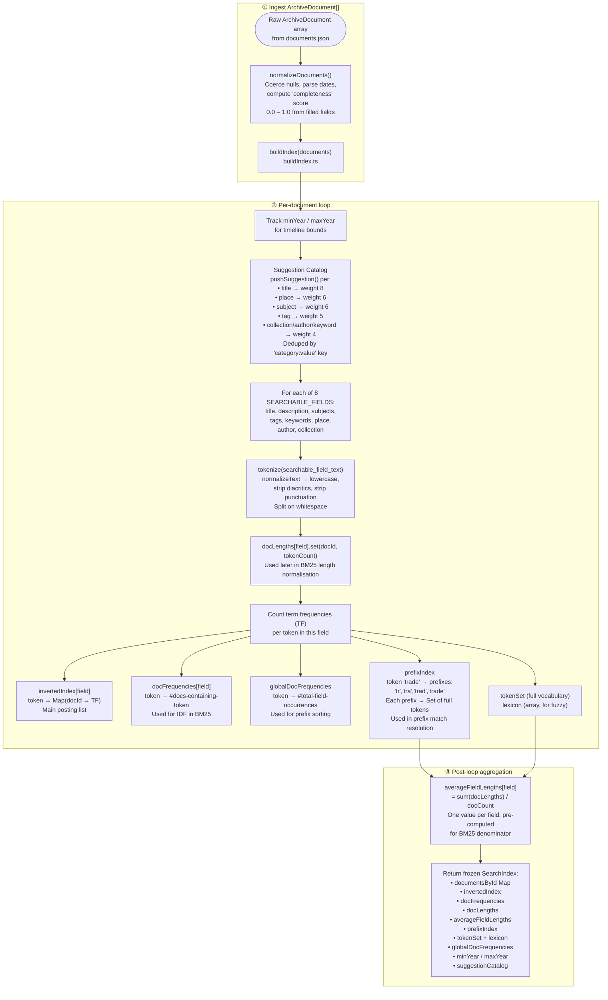
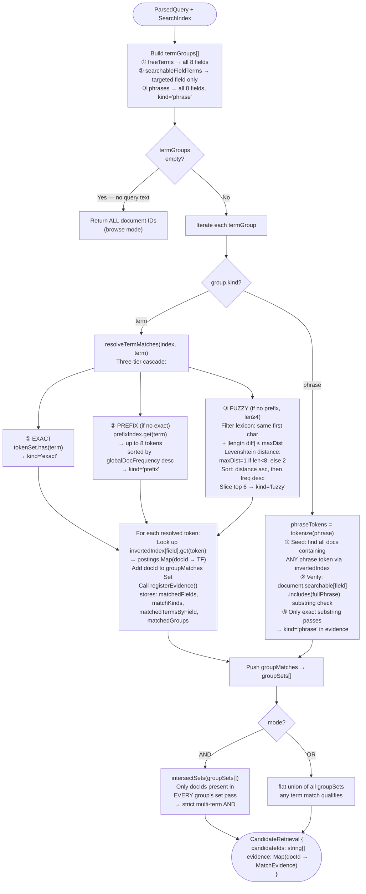
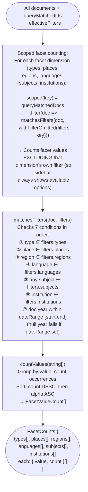
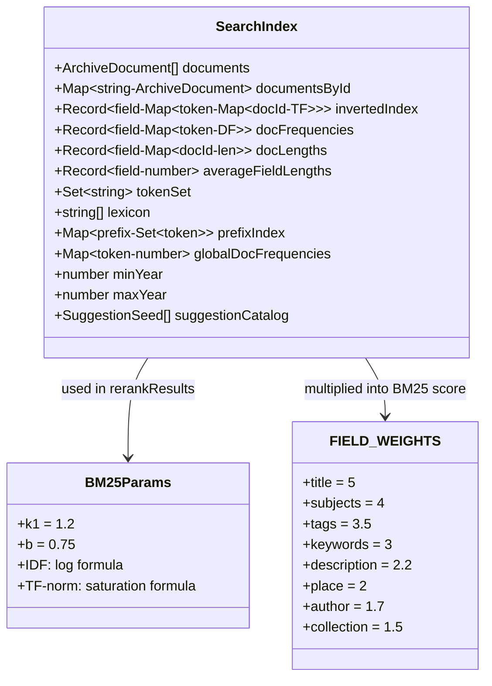

# Search Engine — Complete Technical Flow

> Every internal step from raw documents to ranked, filtered, faceted results.

---

## 🔧 Phase 0 — Index Construction (`buildIndex.ts`)

> Runs **once** at startup when `createSearchEngine(documents)` is called. Output is a frozen `SearchIndex` reused across every query.



---

## 🔍 Phase 1 — Query Parsing (`parseQuery.ts`)

```mermaid
flowchart TD
    RAW([User types raw string\ne.g. 'subject:trade place:London\n\"Persian Gulf\" 1850-1900']) --> NM["normalizeText(raw)\nlowercase + diacritic strip"]

    NM --> FQ["① Field qualifier regex\n/([a-zA-Z]+):(value)/g\nExtracts:\nauthor:X → searchableFieldTerms.author\nsubject:X → searchableFieldTerms.subjects\ntitle:X  → searchableFieldTerms.title\nlanguage:X → facetFieldTerms.language\nregion:X   → facetFieldTerms.region\ntype:X     → facetFieldTerms.type\nReplaced with '' in working string"]

    FQ --> PH["② Phrase extraction\n/\"([^\"]+)\"/g\nnormalizeText(match)\nPushed to phrases[]\nReplaced with space"]

    PH --> YR["③ Year range detection\n/\\d{3,4}\\s*-\\s*\\d{3,4}/\nor 'YYYY to YYYY'\n→ yearRange: [min, max]"]

    YR --> YS["④ Standalone years\n/\\b\\d{4}\\b/g\n→ years[] array\nused for score boost in rerank"]

    YS --> BM["⑤ Boolean mode (advanced only)\n/\\bOR\\b/ → mode='OR'\ndefault → mode='AND'\nAND|OR stripped from freeText"]

    BM --> FT["⑥ Free terms tokenize\ntokenize(remainingText,\n{ minLength:2, removeStopWords:true })\nStop words: a, an, the, of,\nin, to, at, by, for, from, on, with\n→ freeTerms[]"]

    FT --> HL["⑦ Highlight terms union\n[ ...phrases, ...freeTerms,\n  ...searchableFieldTerms.flat() ]\nUsed later in snippet highlighting"]

    HL --> OUT(["ParsedQuery {\n  raw, normalized\n  freeTerms[]\n  phrases[]\n  searchableFieldTerms{}\n  facetFieldTerms{}\n  years[], yearRange\n  mode: AND|OR\n  highlightTerms[]\n  hasText: boolean\n  advanced: boolean\n}"])
```

---

## 🔎 Phase 2 — Candidate Retrieval (`retrieveCandidates.ts`)



---

## 🏆 Phase 3 — Reranking & Scoring (`rerankResults.ts`)

```mermaid
flowchart TD
    CAND([candidateIds[]\n+ evidence Map\n+ ParsedQuery]) --> MAP["Map each docId → SearchResultItem\nwith score=0, reasons=[]"]

    MAP --> HT{hasText?}

    HT -->|No — browse mode| BROWSE["score += completeness × 2.2\nIf doc has year → score += 0.12\nReason: 'Metadata-rich archival record'"]

    HT -->|Yes — query mode| QM["Score each freeTerms[i]:"]

    QM --> FTS["resolveQueryTermMatches(index, term)\nSame exact→prefix→fuzzy cascade\nMultiplier by match kind:\n• exact  → ×1.0\n• prefix → ×0.72\n• fuzzy  → ×0.42"]

    FTS --> BM25["bm25(fieldDocCount, df, tf, fieldLen, avgLen)\nIDF = log(1 + (N-df+0.5)/(df+0.5))\nTF-norm = tf×(k1+1) / tf + k1×(1-b + b×fieldLen/avgLen)\nk1=1.2, b=0.75\nResult × FIELD_WEIGHTS[field] × multiplier\nField weights:\ntitle=5, subjects=4, tags=3.5,\nkeywords=3, description=2.2,\nplace=2, author=1.7, collection=1.5"]

    BM25 --> SFT["searchableFieldTerms scoring:\n• phrase value → substring check\n  → score += fieldWeight × 2.4\n• exact → multiplier ×1.12\n• prefix→ ×0.82 / fuzzy→ ×0.46\n  → BM25 on targeted field only"]

    SFT --> PHRSC["phrases[] scoring:\nFor each phrase × each field:\ndoc.searchable[field].includes(phrase)\nMultiplier:\n• title → ×2.2\n• subjects/tags → ×1.8\n• others → ×1.25\n→ score += fieldWeight × multiplier"]

    PHRSC --> BONUSES["Bonus signals:\n① Title exact match\n   normalized === doc.title → +9.0\n② Title contains query → +4.8\n③ Multi-field hits\n   (matchedFieldCount-1) × 0.65\n④ Curated metadata\n   subjects+tags+keywords hits × 0.82\n⑤ Fuzzy-only penalty → −0.9\n⑥ Exact year in query → +1.7\n⑦ Near year (±5 years) → +0.6\n⑧ Completeness × 0.45"]

    BROWSE & BONUSES --> META["Global micro-bonuses (always):\n• known place → +0.04\n• known author → +0.04"]

    META --> SNIP["buildSnippet(description, highlightTerms)\nFind best 160-char window\ncontaining most highlight terms\n→ snippet string with match markers"]

    SNIP --> SORT["Sort all SearchResultItems\nby score DESC\n→ SearchResultItem[]"]
```

---

## 🗂️ Phase 4 — Filters & Facets (`computeFacets.ts`)



---

## 📊 Phase 5 — Sort & Output

```mermaid
flowchart TD
    SR([SearchResultItem[] ranked]) --> SO{SortOption}
    SO -->|relevance| REL["If hasText: already sorted by BM25\nIf browse: sort score DESC\nthen title ASC as tiebreak"]
    SO -->|newest| NEW["Sort: year DESC\nthen score DESC as tiebreak\n(null year → -Infinity)"]
    SO -->|oldest| OLD["Sort: year ASC\nthen score DESC\n(null year → +Infinity)"]
    SO -->|title| TIT["Sort: title.localeCompare() ASC"]

    REL & NEW & OLD & TIT --> SUGG["suggest(query, suggestionCatalog)\nFilter: normalized.startsWith(query)\n  OR normalized.includes(query)\nSort: startsWith first, then weight DESC\nDedupe by normalized value\nSlice top 6 → Suggestion[]"]

    SUGG --> FINAL(["SearchResponse {\n  results: SearchResultItem[]\n  total: number\n  filteredIds: string[]\n  queryMatchedIds: string[]\n  facetCounts: FacetCounts\n  timeline: TimelineData\n  relationshipGraph: RelationshipGraph\n  suggestions: Suggestion[]\n  filters: SearchFilters\n}"])
```

---

## 🗃️ SearchIndex Structure



---

## 📐 Scoring Formula Reference

| Signal | Formula / Value |
|---|---|
| **BM25 IDF** | `log(1 + (N - df + 0.5) / (df + 0.5))` |
| **BM25 TF-norm** | `tf × (k1+1) / (tf + k1 × (1 - b + b × (fieldLen/avgLen)))` |
| **Final token score** | `BM25 × FIELD_WEIGHTS[field] × matchKindMultiplier` |
| **Exact match mult** | `×1.0 (free), ×1.12 (field-targeted)` |
| **Prefix match mult** | `×0.72 (free), ×0.82 (field-targeted)` |
| **Fuzzy match mult** | `×0.42 (free), ×0.46 (field-targeted)` |
| **Exact title** | `+9.0` |
| **Title contains query** | `+4.8` |
| **Multi-field bonus** | `(matchedFields - 1) × 0.65` |
| **Curated metadata hit** | `+0.82 per hit (subjects/tags/keywords)` |
| **Fuzzy-only penalty** | `−0.9` |
| **Exact year match** | `+1.7` |
| **Near year (±5)** | `+0.6` |
| **Completeness (query)** | `× 0.45` |
| **Completeness (browse)** | `× 2.2` |
| **Has year (browse)** | `+0.12` |
| **Known place/author** | `+0.04 each` |
